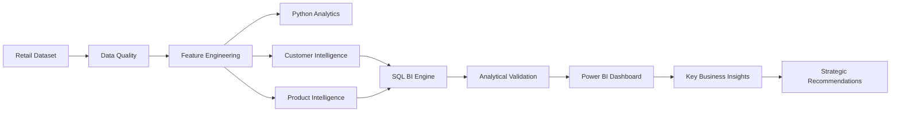

# Retail Customer & Product Intelligence

> End-to-end retail analytics and business intelligence solution transforming customer and product data into actionable commercial insights using Python, SQL, and Power BI.


---

## Overview

This project transforms raw retail customer transaction data into a structured customer and product intelligence layer. It combines Python-based data preparation and exploratory analysis, customer value-engagement segmentation, SQL business intelligence, analytical validation, and Power BI dashboard visualization to convert 3,900 customer snapshot records into evidence-based commercial decision support.

By auditing the baseline dataset, establishing data quality standards, and engineering domain-specific features, this case study answers strategic questions regarding customer spend concentration, subscription participation, discount dependence, product performance rankings, and seasonal demand distribution. The resulting intelligence layer equips executive decision-makers with quantified evidence to optimize customer targeting, promotional strategies, and category merchandising priorities.

---

## Business Problem

Retail organizations frequently operate with siloed customer transaction records that lack actionable commercial structure. Executives and merchandising teams face critical decision gaps:

* **Customer Value & Engagement Disparity**: Difficulty identifying which customer segments drive top-line revenue versus volume participation.
* **Subscription Program Alignment**: Uncertainty regarding whether paid subscribers generate higher single-transaction basket sizes compared to non-subscribers.
* **Discount Dependence**: Lack of clarity on whether promotional discounting expands transaction ticket size or yields lower average order values.
* **Product & Category Portfolio Optimization**: Inability to isolate hero revenue products from customer satisfaction risk items across product categories.

This project bridges the gap between raw customer snapshot records and executive decision support by establishing a multi-layered analytical pipeline spanning **Data Hygiene → Feature Engineering → Exploratory Analytics → SQL Engine → Power BI Dashboard → Business Strategy**.

---

## Project Objectives

1. Clean, validate, and standardize raw retail transaction snapshot records (`customer_shopping_behavior.csv`).
2. Engineer domain-specific analytical features for demographic, spend, and volume classifications.
3. Construct a 9-tier **Customer Value-Engagement Segmentation Matrix**.
4. Conduct high-impact visual Exploratory Data Analysis (EDA) across 16 analytical charts.
5. Aggregate item-level and category-level commercial performance metrics.
6. Develop a 14-query **SQL Business Intelligence Engine** covering 4 strategic analytical domains.
7. Reconcile analytical metrics across 10 validation dimensions between Python and SQL layers with 100% precision.
8. Build a 4-page interactive **Power BI Executive Dashboard** driven by 15 custom DAX measures.
9. Formulate evidence-based commercial recommendations structured by Observation → Implication → Action.
10. Explicitly document analytical boundaries, dataset constraints, and synthetic data properties.

---

## Key Metrics at a Glance

| Metric | Value | Context |
| :--- | ---: | :--- |
| **Records Analyzed** | **3,900** | Cleaned transaction snapshot records |
| **Unique Customers** | **3,900** | 1 snapshot record per unique Customer ID |
| **Products Analyzed** | **25** | Item-level performance tracking |
| **Product Categories** | **4** | Clothing, Accessories, Footwear, Outerwear |
| **Value-Engagement Segments** | **9** | 2D Customer Segmentation Matrix |
| **EDA Visualizations** | **16** | Seaborn/Matplotlib visual dashboards |
| **SQL Business Analyses** | **14** | Production-grade business queries |
| **Validation Reconciliations** | **10** | Python ↔ SQL exact reconciliation checks (100%) |
| **Power BI DAX Measures** | **15** | Dynamic measures protecting Customer ID aggregation |
| **Recorded Revenue** | **$233,081** | Total enterprise transaction revenue |

---

## Technology Stack

| Category | Technologies Used |
| :--- | :--- |
| **Programming Language** | Python 3.13 |
| **Data Manipulation** | Pandas, NumPy |
| **Data Visualization** | Matplotlib, Seaborn |
| **Querying & Modeling** | ANSI SQL, PostgreSQL syntax, SQLite 3 |
| **Business Intelligence** | Microsoft Power BI, DAX (Data Analysis Expressions) |
| **Development Environment** | Jupyter Notebook, Visual Studio Code |
| **Version Control** | Git, GitHub |

---

## End-to-End Workflow



### Analytical Layer Breakdown
1. **Data Quality**: Standardized column names to `snake_case`, imputed missing review ratings using category-level medians, eliminated redundant collinear attributes (`promo_code_used`), and harmonized categorical values.
2. **Feature Engineering**: Engineered demographic bins (`age_group`), encoded purchase frequencies (`purchase_frequency_days`), spend tiers (`customer_value_tier`), volume tiers (`engagement_tier`), and combined `value_engagement_segment` matrix.
3. **Python Analytics**: Executed data profiling, descriptive statistics, segment aggregation, product rankings, and 16 visual EDA charts inside `Customer_Shopping_Behavior_Analysis.ipynb`.
4. **SQL Business Intelligence Engine**: Formulated 14 business-question-driven queries inside `customer_behavior_sql_queries.sql` spanning Customer, Product, Commercial, and Strategic domains.
5. **Analytical Validation**: Executed 10-point reconciliation checks verifying zero discrepancy between Python and SQL outputs.
6. **Power BI Executive Dashboard**: Built a 4-page decision-support dashboard in `customer_behavior_dashboard.pbix` with dynamic slicers and DAX measures.
7. **Business Strategy**: Translated empirical observations into structured, evidence-based recommendations.

---

## Dataset & Data Quality

### Dataset Audit & Hygiene Results

| Dimension | Raw Dataset | Cleaned Dataset | Transformation Action |
| :--- | :--- | :--- | :--- |
| **Total Records** | 3,900 | **3,900** | 100% record preservation verified |
| **Total Columns** | 18 | **23** | Standardized headers, 1 dropped, 6 engineered |
| **Missing Review Ratings** | 37 | **0** | Imputed via category-level median ratings |
| **Duplicate Rows** | 0 | **0** | Confirmed zero duplicate records |
| **Unique Customers** | 3,900 | **3,900** | 1 snapshot transaction per customer ID |
| **Redundant Columns** | 1 (`Promo Code Used`) | **0** | Dropped as 100% collinear with `Discount Applied` |
| **Frequency Categories** | 7 raw strings | **5 categories** | Harmonized `Fortnightly` → `Bi-Weekly` & `Every 3 Months` → `Quarterly` |

---

## Customer Intelligence

Customer intelligence centers on a 2-Dimensional analytical segmentation matrix combining transaction spend with historical purchase volume:

* **Customer Value Tiers**: `Low Value` (< $40), `Medium Value` ($40–$75), `High Value` (> $75).
* **Engagement Tiers**: `Low Engagement` (1–15 previous purchases), `Medium Engagement` (16–35 previous purchases), `High Engagement` (36–50 previous purchases).
* **Value-Engagement Matrix (9 Segments)**: Top revenue drivers are `Medium Value - Medium Engagement` (**$40,937** / 17.56% share) and `High Value - Medium Engagement` (**$40,346** / 17.31% share). High-Value tiers combined contribute **$106,965** (45.89% of enterprise revenue) across 1,214 customers.
* **Demographic Breakdown**: Male customers generate **$157,890** (67.7% share, 2,652 orders) compared to Female customers generating **$75,191** (32.3% share, 1,248 orders). Average Order Value (AOV) is virtually equal between genders (**$59.54** Male vs. **$60.25** Female), confirming that total revenue differences reflect customer volume representation rather than order spend disparity.
* **Subscription Status Parity**: Paid subscribers account for 27.0% of customers (1,053 subscribers) with an AOV of **$59.65**, compared to **$59.80** for non-subscribers (2,847 customers). Paid subscription status does not correlate with single-transaction ticket size expansion.

---

## Analytical Feature Engineering

| Feature Name | Type | Analytical Purpose & Logic |
| :--- | :--- | :--- |
| `age_group` | Categorical | Bins customer age into 4 demographic brackets: `18-30 (Young Adult)`, `31-45 (Adult)`, `46-60 (Middle-Aged)`, `61-70 (Senior)`. |
| `purchase_frequency_days` | Numerical (Encoded) | Maps self-reported categorical purchase frequencies to numerical days (`Weekly`=7, `Bi-Weekly`=14, `Monthly`=30, `Quarterly`=90, `Annually`=365). *Note: Represents encoded categorical responses, not observed transaction intervals.* |
| `customer_value_tier` | Categorical | Classifies transaction spend into `Low Value` (< $40), `Medium Value` ($40–$75), and `High Value` (> $75). |
| `engagement_tier` | Categorical | Classifies historical purchase volume into `Low Engagement` (1–15), `Medium Engagement` (16–35), and `High Engagement` (36–50). |
| `value_engagement_segment` | Categorical | Combines value and engagement tiers into a 9-cell segmentation matrix (e.g. `High Value - High Engagement`). |
| `frequency_of_purchases_raw` | Categorical | Retains un-harmonized raw purchase frequency strings for data lineage auditability. |

---

## Product Intelligence

The product layer evaluates commercial performance across **25 items** and **4 categories**:

| Category | Recorded Revenue | Share (%) | Transaction Volume | AOV ($) | Avg Review Rating | Discount Rate (%) |
| :--- | ---: | ---: | ---: | ---: | ---: | ---: |
| **Clothing** | **$104,264** | 44.73% | 1,737 | $60.03 | 3.72 | 42.08% |
| **Accessories** | **$74,200** | 31.83% | 1,240 | $59.84 | 3.77 | 43.79% |
| **Footwear** | **$36,093** | 15.49% | 599 | $60.26 | 3.79 | 43.24% |
| **Outerwear** | **$18,524** | 7.95% | 324 | $57.17 | 3.75 | 44.44% |
| **Total Enterprise** | **$233,081** | **100.00%** | **3,900** | **$59.76** | **3.75** | **43.00%** |

### Key Product Observations
* **Revenue Concentration**: Clothing and Accessories drive **76.56%** of recorded enterprise revenue (**$178,464**).
* **Hero Products**: Top 3 revenue-generating items are all in Clothing: `Blouse` (**$10,410** across 171 orders), `Shirt` (**$10,332** across 169 orders), and `Dress` (**$10,320** across 166 orders).
* **Satisfaction vs Revenue Variance**: Top rated items (`Gloves` 3.86 avg rating, `Sandals` 3.84) differ from top revenue drivers. `Shirt` (rank #2 in revenue) records the lowest average rating in the dataset (**3.62**), highlighting a product quality management focus area.

---

## SQL Business Intelligence

The SQL engine (`customer_behavior_sql_queries.sql`) contains **14 core analytical business queries** structured across 4 domains:

| Domain | Query # | Business Question Focus | Key SQL Techniques |
| :--- | :---: | :--- | :--- |
| **Customer Intelligence** | Q1–Q4 | Segment revenue contribution, demographic drivers, engagement vs spend, subscription value tier distribution | CTEs, `CROSS JOIN`, conditional aggregation, window functions |
| **Product Intelligence** | Q5–Q8 | Category performance matrix, top 10 products, satisfaction rankings (top/bottom 5), category value preferences | `DENSE_RANK()`, `ROW_NUMBER()`, `UNION ALL`, `GROUP BY` |
| **Commercial Intelligence**| Q9–Q12 | Discount impact on order value, shipping channel performance, payment gateway distribution, seasonal category matrix | `CASE WHEN` pivoting, `AVG() OVER()`, `COUNT()` |
| **Strategic Opportunities**| Q13–Q14 | High-value non-subscriber target identification, category revenue vs discount risk matrix | Multi-dimensional `RANK() OVER()`, complex `WHERE` filtering |

---

## Analytical Validation

To ensure precision and eliminate data discrepancies, analytical outputs were reconciled across **10 key dimensions** between Python Pandas and SQL query outputs:

| Reconciliation Dimension | Python Phase 1 Output | SQL Phase 2 Engine | Discrepancy | Validation Status |
| :--- | :--- | :--- | :--- | :--- |
| **Total Enterprise Revenue** | **$233,081** | **$233,081** | **$0.00** | **EXACT MATCH (100%)** |
| **Total Transactions** | **3,900 orders** | **3,900 orders** | **0** | **EXACT MATCH (100%)** |
| **Unique Customer Count** | **3,900 customers** | **3,900 customers** | **0** | **EXACT MATCH (100%)** |
| **Category Count & Revenue** | 4 ($233,081) | 4 ($233,081) | $0.00 | **EXACT MATCH (100%)** |
| **Top Product (Blouse)** | $10,410 | $10,410 | $0.00 | **EXACT MATCH (100%)** |
| **Top Value-Engagement Segment**| Medium-Medium ($40,937)| Medium-Medium ($40,937)| $0.00 | **EXACT MATCH (100%)** |
| **Subscribers Count & Share** | 1,053 (27.0%) | 1,053 (27.0%) | 0 | **EXACT MATCH (100%)** |
| **Discounted Transactions** | 1,677 (43.0%) | 1,677 (43.0%) | 0 | **EXACT MATCH (100%)** |
| **Distinct Product Count** | 25 items | 25 items | 0 | **EXACT MATCH (100%)** |
| **Distinct Category Count** | 4 categories | 4 categories | 0 | **EXACT MATCH (100%)** |

---

## Power BI Dashboard

**Status**: Complete and Validated (`customer_behavior_dashboard.pbix`)

The Power BI solution consists of **4 executive dashboard pages** supported by **15 explicit DAX measures**, **21 visual containers**, **11 interactive slicers**, and **4 strategic insight panels**:

```
Power BI Dashboard Architecture (customer_behavior_dashboard.pbix)
 ├── Page 1: Executive Overview (Headline KPIs, Category Share, Segment Breakdown, Top Products)
 ├── Page 2: Customer Intelligence (Segment Matrix, Demographic Distribution, Subscriber Rates)
 ├── Page 3: Product Intelligence (Category Rankings, Ratings Extremes, Value Tier Matrix)
 └── Page 4: Commercial Opportunities (Target Cohorts, Discount Dependency, Seasonal Demand)
```

### DAX Measure Implementation Highlights
* **Protected Customer Aggregation**: Enforces `DISTINCTCOUNT(customer_id)` across all customer count metrics, eliminating improper summation errors.
* **Key Baseline Metrics**: Dynamically computes Total Revenue (**$233,081**), Total Orders (**3,900**), Subscriber Rate (**27.0%**), Discount Rate (**43.0%**), Full-Price AOV (**$60.13**), and Discounted AOV (**$59.28**).
* **Opportunity Cohort Identification**: Dynamically isolates the **431 high-value non-subscriber opportunity cohort** (`subscription_status = "No"`, `previous_purchases > 25`, `purchase_amount_usd > 75`).

---

## Key Business Insights

| Insight Area | Empirical Evidence | Business Interpretation |
| :--- | :--- | :--- |
| **Revenue Concentration** | Clothing ($104,264) + Accessories ($74,200) = **76.56% of revenue**. | Primary revenue anchors; inventory depth and promotional focus should center on these two categories. |
| **Subscription Parity** | 1,053 Subscribers (27.0%) AOV = **$59.65** vs Non-Subscribers AOV = **$59.80**. | Subscription status does not correlate with higher single-transaction ticket size. |
| **Discount Dependency** | 1,677 Discounted Orders (43.0%) AOV = **$59.28** vs Full-Price AOV = **$60.13**. | Discounting does not expand transaction basket size; discounted orders show slightly lower AOV. |
| **Non-Subscriber Target Cohort**| **431 Customers** meet >25 previous purchases & >$75 spend criteria. | Highly engaged, high-spending customers exist outside the paid subscription program, forming a conversion cohort. |
| **Outerwear Discount Risk** | Outerwear ranks #4 in revenue ($18,524) but **#1 in discount rate (44.44%)**. | Outerwear exhibits high discount dependency relative to its modest revenue contribution. |

---

## Strategic Recommendations

```
[OBSERVATION] 431 high-value, highly engaged customers are not subscribed.
  └── [IMPLICATION] Significant revenue potential exists without requiring new customer acquisition spend.
        └── [ACTION 1] Launch targeted subscription conversion campaigns for the high-value non-subscriber cohort.

[OBSERVATION] Clothing and Accessories account for 76.56% of total revenue ($178,464).
  └── [IMPLICATION] Inventory allocation directly impacts enterprise revenue stability.
        └── [ACTION 2] Prioritize core merchandising analysis and inventory depth on Clothing and Accessories.

[OBSERVATION] Outerwear exhibits a 44.44% discount rate alongside the lowest category revenue ($18,524).
  └── [IMPLICATION] Promotional discounting in Outerwear may erode revenue without expanding order size.
        └── [ACTION 3] Review promotional discount dependency in Outerwear to optimize promotional strategy.

[OBSERVATION] High-revenue products like Shirt ($10,332) record low review ratings (3.62).
  └── [IMPLICATION] Customer dissatisfaction with volume products poses brand reputation risks.
        └── [ACTION 4] Conduct product quality and customer feedback reviews for lower-rated high-revenue items.

[OBSERVATION] Seasonal category demand peaks in Spring/Winter (Clothing) and Fall/Summer (Accessories).
  └── [IMPLICATION] Promotional timing misalignment risks missed demand capture.
        └── [ACTION 5] Align future seasonal merchandising experiments with observed category-season patterns.
```

---

## Analytical Limitations

1. **Absence of Transaction Timestamps**: The dataset contains no purchase dates. True customer recency, dynamic churn rate, cohort retention, monthly revenue trends, and time-based Customer Lifetime Value (CLV) cannot be calculated.
2. **Snapshot Grain**: Each record represents 1 unique customer transaction snapshot. Multi-item cart analysis (market basket analysis) and true product cross-selling relationships are unsupported.
3. **Absence of Cost & Margin Attributes**: Product unit costs, COGS, and gross profit margins are unrecorded; claims regarding gross profit or margin leakage are qualified as unsupported.
4. **Encoded Purchase Frequency**: `purchase_frequency_days` is an encoded numerical mapping of self-reported categorical frequency responses, not observed transaction intervals.
5. **Synthetic Characteristics**: Near-zero linear correlations across numerical fields (-0.02 to +0.02) reflect synthetic benchmark dataset properties.

---

## Project Structure

```
Retail-Customer-Product-Intelligence/
│
├── Customer_Shopping_Behavior_Analysis.ipynb   # Master Python Data Preparation & EDA Notebook
├── customer_behavior_sql_queries.sql            # 14-Query SQL Business Intelligence Engine
├── customer_behavior_dashboard.pbix             # 4-Page Executive Power BI Dashboard
├── customer_shopping_behavior.csv               # Raw Dataset Snapshot (3,900 records)
│
├── data/
│   └── processed/
│       ├── customer_shopping_behavior_cleaned.csv  # Primary Cleaned Analytical Dataset (3,900x23)
│       ├── customer_intelligence.csv              # Customer Segmentation Analytical Table
│       ├── product_intelligence.csv               # Product Performance Matrix Table
│       ├── category_intelligence.csv              # Category Performance Summary Table
│       └── retail_bi.db                           # SQLite Database Instance
│
├── assets/
│   └── eda_plots/
│       ├── eda_dashboard_part1.png                # High-Res EDA Visual Dashboard Part 1
│       └── eda_dashboard_part2.png                # High-Res EDA Visual Dashboard Part 2
│
├── docs/
│   ├── sql_reconciliation_and_results.md          # SQL Engine Reconciliation Documentation
│   └── power_bi_dashboard_documentation.md        # Power BI DAX & Visual Documentation
│
├── generate_phase1_notebook.py                    # Reproducible Notebook Generation Script
├── run_sql_analysis.py                            # Automated SQL Execution & Test Harness
├── README.md                                      # Master Project Documentation
└── LICENSE                                        # MIT License
```

---

## Future Enhancements

* **Longitudinal Transaction Logs**: Ingest multi-period timestamped transaction data to model dynamic churn, cohort retention, and time-based CLV.
* **Product Cost & Margin Data**: Integrate Unit Cost and Gross Margin data to evaluate true profitability and margin contribution per category.
* **Basket-Level Transaction History**: Ingest line-item order details to enable true Market Basket Analysis, product affinity modeling, and item co-purchase rules.
* **Automated Data Pipeline**: Deploy Orchestrated ETL pipelines (Apache Airflow / Prefect) to automate database ingestion and Power BI dataset refresh.

---

## Author

**Tanya Verma**  
*B.Tech. Computer Engineering, Thapar Institute of Engineering and Technology*

* **GitHub**: [github.com/tanyaverma20](https://github.com/tanyaverma20)
* **LinkedIn**: [linkedin.com/in/tanyaverma20](https://www.linkedin.com/in/tanyaverma20/)

*Built as an end-to-end analytics case study demonstrating Python analytics, feature engineering, SQL business intelligence, Power BI dashboard design, and strategic business decision support.*
